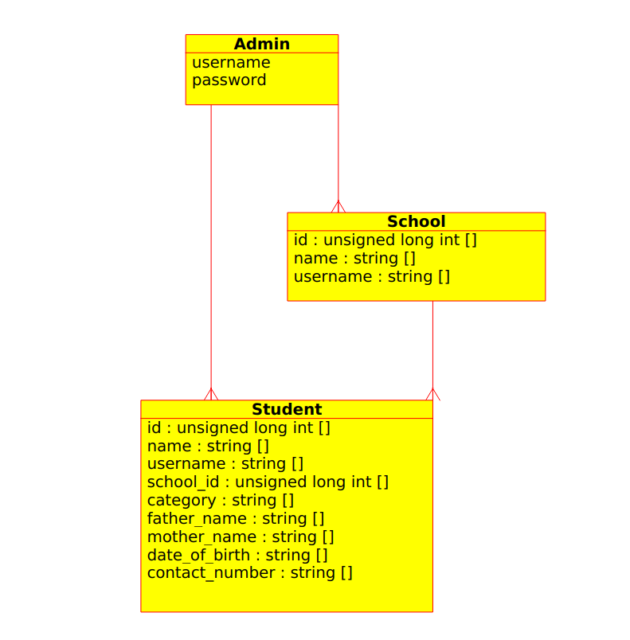

# Project Workflow

-----

## Deployed app
https://hpstse.herokuapp.com/index.php

## Requirements:
	
### Three types of users: Students, Schools, Administrators

Student users are those who will be giving examinations. They are required to have related permissions from the principals and admins before they are allowed to do so. They thus have minimalistic privileges among other categories.

Schools, represented by their principals, will confirm the admin that the student requesting for the examination is eligible for the examination. These will thus have limited set of permissions to view candidacy of the students claiming to be of that particular school.

Administrators, they have all the privileges like addition of a new school. Declining a student for the examination in case of misconduct. Uploading the test question paper, receiving the answers, and so on.

### Different interfaces (Frontend and Backend) for each of the above categories

Students: They have the feature of login as well as signup. The profile deck includes various details required to be filled in by the user for the examination.

Schools: They have a different login interface. They do not have the signup feature. Only admins can add a school to the server and send its details to the concerned authorities. Another special feature is that schools can see the candidacy request from all the students acknowledging to be from their school. These applications once verified will be notified to the student and the authorities.

Administrators: Admins have only the login interface. New admins can only be added by database administrators, this is a security requirement. Admins can view all the schools under their jurisdiction and the students details. Admins also have the authority to add question paper (upload) it before the examination.

### Different privilege levels of each of the above categories.

Students- Should be able to apply and  see the application status. They should be able to download the admit card.

Principals - Should be able to see applications of their school students and all information they have provided and the question paper.

Administrators - Admins can view and add all the schools under their jurisdiction and the students details. Admins also have the authority to add question paper (upload) it before the examination.

### A shared database for storing various information pertaining to the student and examinations

The database will store the information for all the students and schools. The database will be tried to maintain a good enough normalisation to avoid redundancy. The database will be designed in a way to support multiple years and not just a given point of time.

### Registration form for new students
A portal for students to apply for the examination. Students should be able to upload documents and enter the required information on it. The application request will then be passed to the school principal. 

### Admit Card generation for students

Students will be able to download their admit cards. 

### Year Wise separation in the data pointing to the data of that particular year.

Separation of the students data year wise so the data of two different years do not mix. This also makes the data scalable and allows users to use the portal again for the next year.

### Notification functionality with different status of an application.

Various kinds of notifications (preferably in the form of emails) will pertain to different levels in the system. For instance, on registration a welcome notification to the student. On request for verification the school will be verified about the concerned student as well as the student. On confirmation from the school the notification will be sent to admin for approval, this will be notified to the student and the admin. Once the entire process is completed students will be notified about the process being successfully completed.

### Dashboard view for each of the students with editable details.

For each student there will be a dashboard view which will be editable before making a request for verification. If the details are changed after a verification, the previous verification will be rendered void and a new verification process will initiate.

-----

## ER-Model

